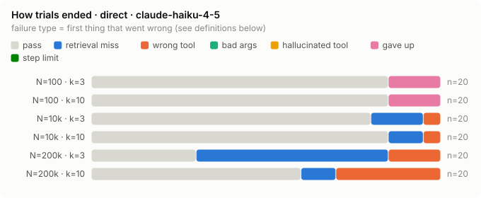
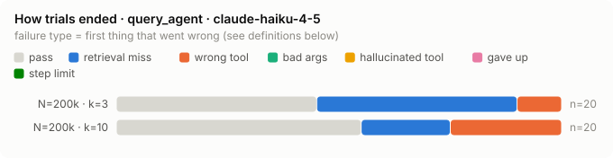
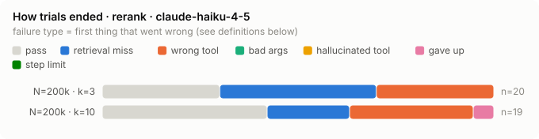

# ToolScale results · run `main1`

**Question.** When an agent has to find its tools by searching a catalog, how does its success change as
the catalog grows (N) and as each search returns more or fewer tools (k)?

**Setup.** 20 tasks (15 single-step, 3 chain, 2 cross-app), 1 repeat: direct retrieval at N 100 / 10k / 200k × k 3 / 10 (120 trials); query_agent retrieval at N 200k × k 3 / 10 (40 trials); rerank retrieval at N 200k × k 3 / 10 (39 trials). **199 trials** on claude-haiku-4-5 (claude-code backend), 2026-09-26 17:08 → 2026-09-26 18:36 UTC. 0 trials ended in a harness/model error (counted as failures). 5.07M tokens total.

All tools and tasks are synthetic and deterministic (generator `g2`); tool calls hit a schema-checking mock. A trial passes only if every expected call is made with the right arguments. Numbers in parentheses are 95% Wilson intervals: with ~20 trials per cell they are wide, so read differences inside overlapping intervals as "not shown", not as "no effect".

## Findings

1. **Up to 10k tools, catalog size barely matters; at 200k it does.** Success was 85% / 80% / 30% at
   N = 100 / 10k / 200k with k = 3, and 85% / 85% / 60% with k = 10. With k = 3, 11 of 20 tasks
   passed at N=100 and failed at 200k, and none went the other way (exact McNemar p = 0.001; this
   survives a Bonferroni correction for the 5 comparisons). With k = 10 the drop is 7 vs 2 flips (p
   = 0.18): likely real, not shown with 20 tasks.

2. **With few results per search (k = 3), the loss is in search, not in the model.** Recall fell
   100% → 85% → 45%; 11 of the 14 failures at 200k / k=3 are the target never reaching the agent,
   even though the agent rephrased and searched again (see the failure table). The embedding search
   can't tell the right tool from hundreds of similar ones in 3 slots.

3. **More results (k = 10) fix search but expose a choice problem.** At 200k, recall rose from 45%
   to 90%, but when the target was delivered the agent picked it only 67% of the time. All 6 wrong
   picks at 200k / k=10 were near-twins from the **same vendor**: another edition (`daybay_v2` for
   "Daybay", `crmbay` for "Crmbay EU", `staffwise_v2` for "Staffwise") or another form of the same
   tool (`by_id` when the prompt gives a URL, `create_calendar` without the visibility variant).
   Trials whose target had 6–20 same-vendor look-alikes in the catalog succeeded 47% of the time vs
   83–85% with ≤ 5.

4. **Two-step tasks were not clearly harder** (chain 83%, cross-app 67%, single 69%; the intervals
   overlap and only 5 two-step tasks ran). The agent reliably carried the created id into the second
   call; when two-step tasks failed, it was for the same reasons as single ones, at 200k.

5. **A librarian (a second model that searches for the agent) did not clearly help, and cost ~2.5×
   more.** At 200k, success was 45% vs 30% with k = 3 (5 tasks gained, 2 lost; p = 0.45) and 55% vs
   60% with k = 10 (1 gained, 2 lost). It used 2.3–2.6× the model calls and ~2.5× the time per
   trial. Why it didn't pay off:
   - It barely used its one real advantage, filtered search: 19 of 219 searches had a filter (when
     it filtered by app it always picked the right app, so filtering itself works).
   - It handed back far fewer tools than allowed (1.8 of 3, 3.2 of 10 on average), so a larger k was
     mostly wasted: recall at k = 10 was 80% vs 90% for plain search.
   - When the target did arrive, the worker still picked the same same-vendor near-twins (t007 fails
     identically in both modes). The obvious next change is making the librarian filter by app by
     default and return the full k, not a different model.

6. **A fast local re-ranker didn't help either, even though offline it looked like it would.**
   Replaying the agent's recorded searches offline, a 22M-parameter cross-encoder (MiniLM, ~50 ms
   per search on a laptop CPU, no LLM, $0) lifted "right tool in the top 3" at 200k from 60% to 76%
   (`rerank-offline-direct.csv`; bge-m3 reached 80% at 1 s per search, bge-base made it worse).
   Live, recall rose (45% → 60% at k = 3) but success did not: 30% vs 30% at k = 3 (2 gained, 2
   lost) and 42% vs 60% at k = 10 (1 gained, 4 lost; p = 0.38, within noise). The trials it lost
   were the same near-twin picks as before (`staffwise_v2` for "Staffwise", by-id for a URL,
   `taskforge` for "Taskforge Enterprise").

**What 4–6 add up to:** at 200k tools, getting the right tool _into_ the agent's hands is mostly
solved by k = 10 (90% recall); what's left is the agent choosing among same-vendor near-twins it was
handed, and no retrieval change (librarian or re-ranker) moves that. The next lever is the choice
itself: a stronger worker model, or tool names/descriptions that make twins easier to tell apart.

**Caveats, read before quoting numbers.**

- **One repeat per setting.** A task can pass or fail on a rerun of the same setting (the model is
  sampled), so single flips between methods include that noise; none of the method comparisons at
  200k is significant. Only the catalog-size effect at k = 3 (finding 1) clears the bar.
- **Harness artifact at N=100.** In 5 of the 40 N=100 trials the target _was_ delivered but the
  model said the tool was "not available" and gave up (t002, t005, t013 ×2, t015). Our side had
  registered the tool; the model apparently tried before Claude Code refreshed its tool list. It
  happened in 0 of 80 trials at larger N. This makes N=100 look worse than it is, so the drop to
  200k is, if anything, understated.
- One model (Claude Haiku 4.5, through Claude Code's agent loop), 20 tasks, librarian and re-ranker
  tested only at N=200k, synthetic tools. The shape of the curve is the result; the absolute rates
  depend on the model and loop.
- t007 ("… on Daybay") failed the same way at every N ≥ 10k (always picked Daybay v2), so it alone
  contributes 4 of the 11 wrong-tool failures. That is a real confusion, but one task, so weigh it
  that way.
- The re-ranker arm has 39 of 40 trials: the 40th (t035, k = 10) hit a harness error when the local
  Docker engine froze, and was dropped rather than counted as a failure.

## Success vs catalog size · direct · claude-haiku-4-5


| N | k=3 | k=10 |
|---|---|---|
| 100 | 85% (64%–95%) n=20 | 85% (64%–95%) n=20 |
| 10k | 80% (58%–92%) n=20 | 85% (64%–95%) n=20 |
| 200k | 30% (15%–52%) n=20 | 60% (39%–78%) n=20 |

## Retrieval: did the agent even get the right tool? · direct · claude-haiku-4-5

If the target never reaches the agent, no model can succeed; this separates search failures from
choice failures.


| N | k=3 | k=10 |
|---|---|---|
| 100 | 100% (84%–100%) n=20 | 100% (84%–100%) n=20 |
| 10k | 85% (64%–95%) n=20 | 90% (70%–97%) n=20 |
| 200k | 45% (26%–66%) n=20 | 90% (70%–97%) n=20 |

Given the target *was* delivered, how often did the agent call it?

| N | k=3 | k=10 |
|---|---|---|
| 100 | 85% (64%–95%) n=20 | 85% (64%–95%) n=20 |
| 10k | 94% (73%–99%) n=17 | 94% (74%–99%) n=18 |
| 200k | 67% (35%–88%) n=9 | 67% (44%–84%) n=18 |

## How trials ended · direct · claude-haiku-4-5



| cell | n | pass | retrieval_miss | wrong_tool | bad_args | hallucinated_tool | gave_up | step_limit |
|---|---|---|---|---|---|---|---|---|
| N=100 · k=3 | 20 | 17 | 0 | 0 | 0 | 0 | 3 | 0 |
| N=100 · k=10 | 20 | 17 | 0 | 0 | 0 | 0 | 3 | 0 |
| N=10k · k=3 | 20 | 16 | 3 | 1 | 0 | 0 | 0 | 0 |
| N=10k · k=10 | 20 | 17 | 2 | 1 | 0 | 0 | 0 | 0 |
| N=200k · k=3 | 20 | 6 | 11 | 3 | 0 | 0 | 0 | 0 |
| N=200k · k=10 | 20 | 12 | 2 | 6 | 0 | 0 | 0 | 0 |

## Paired comparisons · direct · claude-haiku-4-5

Same task, two settings: does it pass in one and fail in the other? Only the tasks that flip carry
information; the exact McNemar test asks whether the flips lean one way more than chance would.

| held fixed | comparison | pairs | pass both | pass only first | pass only second | fail both | p (exact McNemar) |
|---|---|---|---|---|---|---|---|
| k=3 | N=100 → N=200k | 20 | 6 | 11 | 0 | 3 | 0.001 |
| k=10 | N=100 → N=200k | 20 | 10 | 7 | 2 | 1 | 0.180 |
| N=100 | k=3 → k=10 | 20 | 15 | 2 | 2 | 1 | 1.000 |
| N=10k | k=3 → k=10 | 20 | 16 | 0 | 1 | 3 | 1.000 |
| N=200k | k=3 → k=10 | 20 | 5 | 1 | 7 | 7 | 0.070 |

## Success vs catalog size · query_agent · claude-haiku-4-5

_One catalog size only: no curve._

| N | k=3 | k=10 |
|---|---|---|
| 200k | 45% (26%–66%) n=20 | 55% (34%–74%) n=20 |

## Retrieval: did the agent even get the right tool? · query_agent · claude-haiku-4-5

If the target never reaches the agent, no model can succeed; this separates search failures from
choice failures.


| N | k=3 | k=10 |
|---|---|---|
| 200k | 55% (34%–74%) n=20 | 80% (58%–92%) n=20 |

Given the target *was* delivered, how often did the agent call it?

| N | k=3 | k=10 |
|---|---|---|
| 200k | 82% (52%–95%) n=11 | 69% (44%–86%) n=16 |

## How trials ended · query_agent · claude-haiku-4-5



| cell | n | pass | retrieval_miss | wrong_tool | bad_args | hallucinated_tool | gave_up | step_limit |
|---|---|---|---|---|---|---|---|---|
| N=200k · k=3 | 20 | 9 | 9 | 2 | 0 | 0 | 0 | 0 |
| N=200k · k=10 | 20 | 11 | 4 | 5 | 0 | 0 | 0 | 0 |

## Paired comparisons · query_agent · claude-haiku-4-5

Same task, two settings: does it pass in one and fail in the other? Only the tasks that flip carry
information; the exact McNemar test asks whether the flips lean one way more than chance would.

| held fixed | comparison | pairs | pass both | pass only first | pass only second | fail both | p (exact McNemar) |
|---|---|---|---|---|---|---|---|
| N=200k | k=3 → k=10 | 20 | 8 | 1 | 3 | 8 | 0.625 |

## Success vs catalog size · rerank · claude-haiku-4-5

_One catalog size only: no curve._

| N | k=3 | k=10 |
|---|---|---|
| 200k | 30% (15%–52%) n=20 | 42% (23%–64%) n=19 |

## Retrieval: did the agent even get the right tool? · rerank · claude-haiku-4-5

If the target never reaches the agent, no model can succeed; this separates search failures from
choice failures.


| N | k=3 | k=10 |
|---|---|---|
| 200k | 60% (39%–78%) n=20 | 79% (57%–91%) n=19 |

Given the target *was* delivered, how often did the agent call it?

| N | k=3 | k=10 |
|---|---|---|
| 200k | 50% (25%–75%) n=12 | 53% (30%–75%) n=15 |

## How trials ended · rerank · claude-haiku-4-5



| cell | n | pass | retrieval_miss | wrong_tool | bad_args | hallucinated_tool | gave_up | step_limit |
|---|---|---|---|---|---|---|---|---|
| N=200k · k=3 | 20 | 6 | 8 | 6 | 0 | 0 | 0 | 0 |
| N=200k · k=10 | 19 | 8 | 4 | 6 | 0 | 0 | 1 | 0 |

## Paired comparisons · rerank · claude-haiku-4-5

Same task, two settings: does it pass in one and fail in the other? Only the tasks that flip carry
information; the exact McNemar test asks whether the flips lean one way more than chance would.

| held fixed | comparison | pairs | pass both | pass only first | pass only second | fail both | p (exact McNemar) |
|---|---|---|---|---|---|---|---|
| N=200k | k=3 → k=10 | 19 | 4 | 1 | 4 | 10 | 0.375 |

## Retrieval methods compared

`direct`: the agent's request is embedded and the top-k tools from the vector search are handed over.
In `rerank` mode the vector search returns its top 50 and a small local cross-encoder (one forward pass, no LLM) re-orders them; the worker gets the top k.
In `query_agent` mode a second model (the librarian) turns the agent's request into one or more filtered searches (by app, resource, action) and hands back ≤ k tools.
Cross-encoder used: minilm.
Same tasks, same catalogs.


| setting | method | n | success (95% CI) | recall@k | select | hit | LLM calls / trial | input tokens / trial | seconds / trial | re-rank ms / search | API-price estimate / trial |
|---|---|---|---|---|---|---|---|---|---|---|
| N=200k · k=3 | direct | 20 | 30% (15%–52%) | 45% | 67% | 6.5 | 20k | 16 | – | $0.026 |
| N=200k · k=3 | re-ranker | 20 | 30% (15%–52%) | 60% | 50% | 5.8 | 17k | 16 | 59 | $0.023 |
| N=200k · k=3 | librarian | 20 | 45% (26%–66%) | 55% | 82% | 16.6 | 37k | 42 | – | $0.056 |
| N=200k · k=10 | direct | 20 | 60% (39%–78%) | 90% | 67% | 6.2 | 27k | 16 | – | $0.035 |
| N=200k · k=10 | re-ranker | 19 | 42% (23%–64%) | 79% | 53% | 5.7 | 24k | 14 | 54 | $0.032 |
| N=200k · k=10 | librarian | 20 | 55% (34%–74%) | 80% | 69% | 14.4 | 38k | 37 | – | $0.057 |

API-price estimate = what Claude Code reports the trial would cost at API prices (nothing is billed on
a subscription); the re-ranker runs locally and costs nothing.

Task by task, each method against direct on the same task:

| setting | method | pairs | pass both | pass only direct | pass only method | fail both | p (exact McNemar) |
|---|---|---|---|---|---|---|---|
| N=200k · k=3 | re-ranker | 20 | 4 | 2 | 2 | 12 | 1.000 |
| N=200k · k=3 | librarian | 20 | 4 | 2 | 5 | 9 | 0.453 |
| N=200k · k=10 | re-ranker | 19 | 7 | 4 | 1 | 7 | 0.375 |
| N=200k · k=10 | librarian | 20 | 10 | 2 | 1 | 7 | 1.000 |

## By task kind

| kind | n | success (95% CI) | recall@k | select | hit | parts done |
|---|---|---|---|---|---|
| single | 150 | 59% (51%–66%) | 78% | 75% | 59% |
| chain | 29 | 69% (51%–83%) | 83% | 83% | 71% |
| cross_app | 20 | 55% (34%–74%) | 75% | 73% | 78% |

## By look-alikes in the catalog

Look-alikes = other tools in *that trial's* catalog with the same resource + action as a target
(e.g. every "delete job posting" tool). This grows with N, so it overlaps with the N effect.

| look-alikes | n | success (95% CI) | recall@k | select | hit | parts done |
|---|---|---|---|---|---|
| 0 | 30 | 80% (63%–90%) | 100% | 80% | 82% |
| 1–5 | 10 | 100% (72%–100%) | 100% | 100% | 100% |
| 6–20 | 20 | 70% (48%–85%) | 80% | 88% | 70% |
| 21–100 | 20 | 95% (76%–99%) | 95% | 100% | 95% |
| >100 | 119 | 44% (35%–53%) | 68% | 64% | 47% |

Same, counting only the target's own vendor (other editions like "Slack Enterprise", other id forms):

| same-vendor | n | success (95% CI) | recall@k | select | hit | parts done |
|---|---|---|---|---|---|
| 0 | 60 | 83% (72%–91%) | 93% | 89% | 84% |
| 1–5 | 20 | 85% (64%–95%) | 95% | 89% | 85% |
| 6–20 | 107 | 45% (36%–54%) | 68% | 66% | 49% |
| 21–100 | 12 | 33% (14%–61%) | 67% | 50% | 33% |

## Every task × every setting

✓ = pass; otherwise the failure: RM retrieval miss, WT wrong tool, BA bad args, HT hallucinated tool,
GU gave up, SL step limit, ERR error. A row that fails everywhere is worth checking for a task-wording
problem before blaming the model.

**direct · claude-haiku-4-5**

| task | kind | 100 / k3 | 100 / k10 | 10k / k3 | 10k / k10 | 200k / k3 | 200k / k10 | pass |
|---|---|---|---|---|---|---|---|---|
| t001 | single | ✓ | ✓ | ✓ | ✓ | ✓ | ✓ | 6/6 |
| t002 | single | GU | ✓ | ✓ | ✓ | RM | ✓ | 4/6 |
| t003 | single | ✓ | ✓ | ✓ | ✓ | ✓ | WT | 5/6 |
| t004 | single | ✓ | ✓ | ✓ | ✓ | RM | ✓ | 5/6 |
| t005 | single | ✓ | GU | RM | RM | ✓ | ✓ | 3/6 |
| t006 | single | ✓ | ✓ | RM | RM | WT | WT | 2/6 |
| t007 | single | ✓ | ✓ | WT | WT | WT | WT | 2/6 |
| t008 | single | ✓ | ✓ | ✓ | ✓ | RM | RM | 4/6 |
| t009 | single | ✓ | ✓ | ✓ | ✓ | RM | RM | 4/6 |
| t010 | single | ✓ | ✓ | ✓ | ✓ | ✓ | ✓ | 6/6 |
| t011 | single | ✓ | ✓ | ✓ | ✓ | RM | ✓ | 5/6 |
| t012 | single | ✓ | ✓ | ✓ | ✓ | ✓ | ✓ | 6/6 |
| t013 | single | GU | GU | RM | ✓ | RM | ✓ | 2/6 |
| t014 | single | ✓ | ✓ | ✓ | ✓ | RM | ✓ | 5/6 |
| t015 | single | ✓ | GU | ✓ | ✓ | RM | WT | 3/6 |
| t031 | chain | ✓ | ✓ | ✓ | ✓ | ✓ | ✓ | 6/6 |
| t032 | cross_app | GU | ✓ | ✓ | ✓ | RM | WT | 3/6 |
| t033 | chain | ✓ | ✓ | ✓ | ✓ | RM | WT | 4/6 |
| t034 | cross_app | ✓ | ✓ | ✓ | ✓ | WT | ✓ | 5/6 |
| t035 | chain | ✓ | ✓ | ✓ | ✓ | RM | ✓ | 5/6 |

**query_agent · claude-haiku-4-5**

| task | kind | 200k / k3 | 200k / k10 | pass |
|---|---|---|---|---|
| t001 | single | ✓ | ✓ | 2/2 |
| t002 | single | RM | WT | 0/2 |
| t003 | single | RM | RM | 0/2 |
| t004 | single | ✓ | ✓ | 2/2 |
| t005 | single | RM | ✓ | 1/2 |
| t006 | single | RM | RM | 0/2 |
| t007 | single | WT | WT | 0/2 |
| t008 | single | RM | WT | 0/2 |
| t009 | single | WT | WT | 0/2 |
| t010 | single | ✓ | ✓ | 2/2 |
| t011 | single | ✓ | ✓ | 2/2 |
| t012 | single | ✓ | ✓ | 2/2 |
| t013 | single | RM | ✓ | 1/2 |
| t014 | single | ✓ | ✓ | 2/2 |
| t015 | single | RM | ✓ | 1/2 |
| t031 | chain | ✓ | ✓ | 2/2 |
| t032 | cross_app | ✓ | RM | 1/2 |
| t033 | chain | RM | WT | 0/2 |
| t034 | cross_app | ✓ | ✓ | 2/2 |
| t035 | chain | RM | RM | 0/2 |

**rerank · claude-haiku-4-5**

| task | kind | 200k / k3 | 200k / k10 | pass |
|---|---|---|---|---|
| t001 | single | ✓ | WT | 1/2 |
| t002 | single | WT | WT | 0/2 |
| t003 | single | RM | ✓ | 1/2 |
| t004 | single | RM | ✓ | 1/2 |
| t005 | single | ✓ | ✓ | 2/2 |
| t006 | single | RM | RM | 0/2 |
| t007 | single | WT | WT | 0/2 |
| t008 | single | RM | RM | 0/2 |
| t009 | single | WT | WT | 0/2 |
| t010 | single | ✓ | ✓ | 2/2 |
| t011 | single | ✓ | ✓ | 2/2 |
| t012 | single | WT | ✓ | 1/2 |
| t013 | single | RM | RM | 0/2 |
| t014 | single | RM | ✓ | 1/2 |
| t015 | single | WT | WT | 0/2 |
| t031 | chain | ✓ | ✓ | 2/2 |
| t032 | cross_app | RM | GU | 0/2 |
| t033 | chain | WT | WT | 0/2 |
| t034 | cross_app | RM | RM | 0/2 |
| t035 | chain | ✓ |  | 1/1 |

## Every failed trial

Open `report.html` in this folder (links below) for the full step-by-step story of each trial.

| task | mode | N | k | outcome | what happened | story |
|---|---|---|---|---|---|---|
| t002 | direct | 100 | 3 | gave_up | finish(cannot_complete): The search results indicated a tool for answering notes in Saleswave Enterprise (mcp__ts__saleswave_enterprise_reply_not | [3e00a3e091a6](report.html#t-3e00a3e091a6) |
| t002 | direct | 200k | 3 | retrieval_miss | never received saleswave_enterprise_reply_note_by_url; asked for "access Saleswave Enterprise, answer a jotting/note at a specific URL", "answer or reply to a jotting in Saleswave Enterprise" | [2108d403c6e3](report.html#t-2108d403c6e3) |
| t003 | direct | 200k | 10 | wrong_tool | called crmbay_reopen_deal_by_id instead of crmbay_eu_reopen_deal_by_id | [03141fbd8309](report.html#t-03141fbd8309) |
| t004 | direct | 200k | 3 | retrieval_miss | never received signalbay_enterprise_delete_dashboard_by_id; asked for "delete or remove a metrics view in Signalbay Enterprise", "delete metrics view in Signalbay Enterprise with ID" | [1e0122c117fa](report.html#t-1e0122c117fa) |
| t005 | direct | 10k | 3 | retrieval_miss | never received chargebay_us_list_payout; asked for "access Chargebay US to retrieve transfer outs on the Globex account", "Chargebay US list transfer outs account", "Chargebay US get transfer outs" | [8e8fe5641979](report.html#t-8e8fe5641979) |
| t005 | direct | 100 | 10 | gave_up | finish(cannot_complete): The tool mcp__ts__chargebay_us_list_payout for accessing Chargebay US account data and transfer outs is not currently av | [f02bb0f8ae06](report.html#t-f02bb0f8ae06) |
| t005 | direct | 10k | 10 | retrieval_miss | never received chargebay_us_list_payout; asked for "access Chargebay US to retrieve transfer outs on the Globex account", "list transfers or transfer outs in Chargebay US", "Chargebay US account transactions or Globex account details" | [f4b709bd96e3](report.html#t-f4b709bd96e3) |
| t006 | direct | 10k | 3 | retrieval_miss | never received knownest_share_page_by_url; asked for "share or collaborate on a page/document on Knownest with specific email addresses", "Knownest page sharing or collaboration" | [c4e19528b643](report.html#t-c4e19528b643) |
| t006 | direct | 200k | 3 | wrong_tool | called knownest_eu_share_page_by_url instead of knownest_share_page_by_url | [71f4e2233657](report.html#t-71f4e2233657) |
| t006 | direct | 10k | 10 | retrieval_miss | never received knownest_share_page_by_url; asked for "share or add access to a page/write-up on Knownest with specific email addresses", "Knownest page sharing or access management", "share a page on Knownest" | [58428b71108f](report.html#t-58428b71108f) |
| t006 | direct | 200k | 10 | wrong_tool | called knownest_share_page_by_id instead of knownest_share_page_by_url | [ed5dc1c67a7a](report.html#t-ed5dc1c67a7a) |
| t007 | direct | 10k | 3 | wrong_tool | called daybay_v2_create_event instead of daybay_create_event | [dfd08b7cfbdf](report.html#t-dfd08b7cfbdf) |
| t007 | direct | 200k | 3 | wrong_tool | called daybay_v2_create_event instead of daybay_create_event | [36d1435b847b](report.html#t-36d1435b847b) |
| t007 | direct | 10k | 10 | wrong_tool | called daybay_v2_create_event instead of daybay_create_event | [3984c812a8c8](report.html#t-3984c812a8c8) |
| t007 | direct | 200k | 10 | wrong_tool | called daybay_v2_create_event instead of daybay_create_event | [ae09456ed777](report.html#t-ae09456ed777) |
| t008 | direct | 200k | 3 | retrieval_miss | never received slack_enterprise_pin_thread_by_id; asked for "pin or stick a message/conversation in Slack Enterprise" | [7c99a38059cc](report.html#t-7c99a38059cc) |
| t008 | direct | 200k | 10 | retrieval_miss | never received slack_enterprise_pin_thread_by_id; asked for "pin or stick a conversation/message in Slack" | [8963fa80c968](report.html#t-8963fa80c968) |
| t009 | direct | 200k | 3 | retrieval_miss | never received gitforge_v2_get_branch_by_id; asked for "lookup reference number in Gitforge v2" | [5ce537b14745](report.html#t-5ce537b14745) |
| t009 | direct | 200k | 10 | retrieval_miss | never received gitforge_v2_get_branch_by_id; asked for "look up reference number in Gitforge v2" | [203c06804a7b](report.html#t-203c06804a7b) |
| t011 | direct | 200k | 3 | retrieval_miss | never received campaignly_us_delete_signature_by_id; asked for "delete or drop a sign-off block in Campaignly", "delete or remove a sign-off block by ID in Campaignly" | [5db1079ebd1a](report.html#t-5db1079ebd1a) |
| t013 | direct | 100 | 3 | gave_up | finish(cannot_complete): The Merchnest v2 archive tool was identified in the catalog but is not available for use. While the tool "mcp__ts__merch | [8bcd5e1435e1](report.html#t-8bcd5e1435e1) |
| t013 | direct | 100 | 10 | gave_up | finish(cannot_complete): The appropriate tool for shelving the SKU listing (mcp__ts__merchnest_v2_archive_product_by_url) was identified but is n | [2173d8abc29d](report.html#t-2173d8abc29d) |
| t013 | direct | 10k | 3 | retrieval_miss | never received merchnest_v2_archive_product_by_url; asked for "update or shelve a product listing on Merchnest e-commerce platform", "get or retrieve product details from Merchnest v2 by product ID or SKU" | [fd1231fedae9](report.html#t-fd1231fedae9) |
| t013 | direct | 200k | 3 | retrieval_miss | never received merchnest_v2_archive_product_by_url; asked for "shelve or update product listing status on Merchnest v2", "shelve or archive product on Merchnest", "shelve product Merchnest v2" | [e9d28c6e8e3a](report.html#t-e9d28c6e8e3a) |
| t014 | direct | 200k | 3 | retrieval_miss | never received bugloop_eu_create_epic_due; asked for "create an umbrella item in Bugloop EU under the API project", "create an item or ticket in Bugloop EU", "create an umbrella item in Bugloop EU with due date" | [734f09a74b21](report.html#t-734f09a74b21) |
| t015 | direct | 100 | 10 | gave_up | finish(cannot_complete): The Knowly Cloud workspace update tool (mcp__ts__knowly_cloud_update_workspace_by_url) was found in the search results b | [c2e28c165d11](report.html#t-c2e28c165d11) |
| t015 | direct | 200k | 10 | wrong_tool | called knowly_cloud_update_workspace_by_id instead of knowly_cloud_update_workspace_by_url | [ad9a187678a6](report.html#t-ad9a187678a6) |
| t015 | direct | 200k | 3 | retrieval_miss | never received knowly_cloud_update_workspace_by_url; asked for "edit or rename a workspace in Knowly Cloud", "update a Knowly workspace by ID or get workspace details from ID", "update a Knowly Cloud workspace by ID" | [01bbd85ad048](report.html#t-01bbd85ad048) |
| t032 | direct | 100 | 3 | gave_up | finish(completed): Created public agenda 'q4-launch' in Sales workspace (ID: 63142). Unable to retrieve Trackbay EU epic details due to too [1/2 parts done] | [237091dd9b16](report.html#t-237091dd9b16) |
| t032 | direct | 200k | 3 | retrieval_miss | never received slotnest_cloud_create_calendar_vis; asked for "create and manage agendas in Slotnest Cloud, specifically in Sales", "access Trackbay EU to view epics or umbrella items", "create agenda in Slotnest Cloud", "make agenda or calendar public in Slotnest Cloud" [1/2 parts done] | [72b240d41770](report.html#t-72b240d41770) |
| t032 | direct | 200k | 10 | wrong_tool | called slotnest_cloud_create_calendar instead of slotnest_cloud_create_calendar_vis [1/2 parts done] | [79ad3f97cf8a](report.html#t-79ad3f97cf8a) |
| t033 | direct | 200k | 3 | retrieval_miss | never received staffwise_create_onboard_task; asked for "file a new-hire to-do in Support via Staffwise", "Staffwise create task to-do Support new-hire", "accept or approve a Staffwise task" [0/2 parts done] | [5cca235626c9](report.html#t-5cca235626c9) |
| t033 | direct | 200k | 10 | wrong_tool | called staffwise_v2_create_onboard_task instead of staffwise_create_onboard_task [0/2 parts done] | [43582e1e07f5](report.html#t-43582e1e07f5) |
| t034 | direct | 200k | 3 | wrong_tool | called knownest_list_workspace instead of knownest_enterprise_list_workspace [1/2 parts done] | [b35c96738c3e](report.html#t-b35c96738c3e) |
| t035 | direct | 200k | 3 | retrieval_miss | never received signalwave_enterprise_create_silence; asked for "create or set up a quiet period in Signalwave Enterprise", "cancel or remove a silence in Signalwave" [0/2 parts done] | [d43a1e3a807b](report.html#t-d43a1e3a807b) |
| t002 | query_agent | 200k | 3 | retrieval_miss | never received saleswave_enterprise_reply_note_by_url; asked for "interact with Saleswave Enterprise, add a comment or answer to a note/jotting" | [3109620bbde3](report.html#t-3109620bbde3) |
| t002 | query_agent | 200k | 10 | wrong_tool | called saleswave_enterprise_reply_note_by_id instead of saleswave_enterprise_reply_note_by_url | [d2ed3616cef0](report.html#t-d2ed3616cef0) |
| t003 | query_agent | 200k | 3 | retrieval_miss | never received crmbay_eu_reopen_deal_by_id; asked for "revive or reopen a sales opportunity/deal in Crmbay EU CRM", "Crmbay reopen or revive deal 89438" | [b6242a579ed2](report.html#t-b6242a579ed2) |
| t003 | query_agent | 200k | 10 | retrieval_miss | never received crmbay_eu_reopen_deal_by_id; asked for "revive or update a sale in Crmbay EU CRM system" | [7eeecfff5cad](report.html#t-7eeecfff5cad) |
| t005 | query_agent | 200k | 3 | retrieval_miss | never received chargebay_us_list_payout; asked for "access Chargebay US account, retrieve transfer outs on Globex account", "get transfer transactions, list transfers on account Chargebay" | [b3d53a160200](report.html#t-b3d53a160200) |
| t006 | query_agent | 200k | 10 | retrieval_miss | never received knownest_share_page_by_url; asked for "write or update a page on Knownest" | [1a81917ae527](report.html#t-1a81917ae527) |
| t007 | query_agent | 200k | 3 | wrong_tool | called daybay_create_event_invite instead of daybay_create_event | [fe582f04cf72](report.html#t-fe582f04cf72) |
| t006 | query_agent | 200k | 3 | retrieval_miss | never received knownest_share_page_by_url; asked for "Knownest write-up or page editor for people ops", "update or write to a web page or document platform" | [c79ff2f295d6](report.html#t-c79ff2f295d6) |
| t008 | query_agent | 200k | 3 | retrieval_miss | never received slack_enterprise_pin_thread_by_id; asked for "pin or stick a conversation in Slack Enterprise" | [474403d0d8a2](report.html#t-474403d0d8a2) |
| t008 | query_agent | 200k | 10 | wrong_tool | called slack_enterprise_pin_message_by_id instead of slack_enterprise_pin_thread_by_id | [7452e1688b46](report.html#t-7452e1688b46) |
| t007 | query_agent | 200k | 10 | wrong_tool | called daybay_create_booking instead of daybay_create_event | [d494f73238a4](report.html#t-d494f73238a4) |
| t009 | query_agent | 200k | 3 | wrong_tool | called gitforge_v2_get_issue_by_id instead of gitforge_v2_get_branch_by_id | [6b304d06299b](report.html#t-6b304d06299b) |
| t009 | query_agent | 200k | 10 | wrong_tool | called gitforge_v2_get_issue_by_id instead of gitforge_v2_get_branch_by_id | [5aef33c26d09](report.html#t-5aef33c26d09) |
| t013 | query_agent | 200k | 3 | retrieval_miss | never received merchnest_v2_archive_product_by_url; asked for "shelve or deactivate a product SKU listing on Merchnest marketplace", "update product status or manage SKU inventory on Merchnest", "get or retrieve product details from Merchnest v2 by product ID" | [4f1a2a4f8ddc](report.html#t-4f1a2a4f8ddc) |
| t015 | query_agent | 200k | 3 | retrieval_miss | never received knowly_cloud_update_workspace_by_url; asked for "edit a workspace in Knowly Cloud to rename it", "get information about a Knowly Cloud workspace by its ID", "update a workspace in Knowly Cloud by its ID to rename it" | [03986e30fa85](report.html#t-03986e30fa85) |
| t032 | query_agent | 200k | 10 | retrieval_miss | never received slotnest_cloud_create_calendar_vis; asked for "create an agenda in Slotnest Cloud within Sales and make it public", "access and display an umbrella item from Trackbay EU using a URL" [1/2 parts done] | [d6a6aa2d97ff](report.html#t-d6a6aa2d97ff) |
| t033 | query_agent | 200k | 3 | retrieval_miss | never received staffwise_create_onboard_task; asked for "file a to-do in Staffwise Support category", "Staffwise task management create new to-do", "Staffwise accept task or to-do" [0/2 parts done] | [c276eef96b92](report.html#t-c276eef96b92) |
| t033 | query_agent | 200k | 10 | wrong_tool | called staffwise_cloud_create_onboard_task, staffwise_cloud_approve_onboard_task_by_id instead of staffwise_create_onboard_task, staffwise_approve_onboard_task_by_id [0/2 parts done] | [e85cc0f3d491](report.html#t-e85cc0f3d491) |
| t035 | query_agent | 200k | 3 | retrieval_miss | never received signalwave_enterprise_create_silence, signalwave_enterprise_cancel_silence_by_id; asked for "Signalwave Enterprise quiet period management - create and close quiet periods" [0/2 parts done] | [fe535a453ebe](report.html#t-fe535a453ebe) |
| t035 | query_agent | 200k | 10 | retrieval_miss | never received signalwave_enterprise_cancel_silence_by_id; asked for "Signalwave Enterprise quiet period management", "Signalwave Enterprise create add silence quiet period" [1/2 parts done] | [5c9773a55e16](report.html#t-5c9773a55e16) |
| t001 | rerank | 200k | 10 | wrong_tool | called staffwise_v2_delete_job_posting_by_id instead of staffwise_delete_job_posting_by_id | [b7baeec5d7f7](report.html#t-b7baeec5d7f7) |
| t002 | rerank | 200k | 3 | wrong_tool | called saleswave_enterprise_reply_note_by_id instead of saleswave_enterprise_reply_note_by_url | [4f7891ca9c1e](report.html#t-4f7891ca9c1e) |
| t002 | rerank | 200k | 10 | wrong_tool | called saleswave_enterprise_reply_note_by_id instead of saleswave_enterprise_reply_note_by_url | [b63221885ee3](report.html#t-b63221885ee3) |
| t004 | rerank | 200k | 3 | retrieval_miss | never received signalbay_enterprise_delete_dashboard_by_id; asked for "delete or remove a metrics view in Signalbay Enterprise", "Signalbay Enterprise delete metrics view", "Signalbay metrics" | [ed79ebf23750](report.html#t-ed79ebf23750) |
| t003 | rerank | 200k | 3 | retrieval_miss | never received crmbay_eu_reopen_deal_by_id; asked for "revive or update a sale in progress on Crmbay CRM system" | [15531e67ef65](report.html#t-15531e67ef65) |
| t006 | rerank | 200k | 3 | retrieval_miss | never received knownest_share_page_by_url; asked for "share or grant access to a write-up on Knownest with specific email addresses" | [a5981453c5c2](report.html#t-a5981453c5c2) |
| t006 | rerank | 200k | 10 | retrieval_miss | never received knownest_share_page_by_url; asked for "share or grant access to a write-up on Knownest with specific email addresses", "Knownest share or grant access to pages or content" | [5954c766c931](report.html#t-5954c766c931) |
| t007 | rerank | 200k | 3 | wrong_tool | called daybay_v2_create_event instead of daybay_create_event | [fbdd7282dd0b](report.html#t-fbdd7282dd0b) |
| t008 | rerank | 200k | 3 | retrieval_miss | never received slack_enterprise_pin_thread_by_id; asked for "pin or stick a conversation in Slack Enterprise" | [6ea89bbf158a](report.html#t-6ea89bbf158a) |
| t007 | rerank | 200k | 10 | wrong_tool | called daybay_cloud_create_event instead of daybay_create_event | [568b3209992d](report.html#t-568b3209992d) |
| t008 | rerank | 200k | 10 | retrieval_miss | never received slack_enterprise_pin_thread_by_id; asked for "pin or stick a conversation in Slack Enterprise" | [b4e552c52f75](report.html#t-b4e552c52f75) |
| t009 | rerank | 200k | 3 | wrong_tool | called gitforge_v2_get_issue_by_id instead of gitforge_v2_get_branch_by_id | [99d4e5b67eb2](report.html#t-99d4e5b67eb2) |
| t009 | rerank | 200k | 10 | wrong_tool | called gitforge_v2_get_issue_by_id instead of gitforge_v2_get_branch_by_id | [57341888c0c5](report.html#t-57341888c0c5) |
| t012 | rerank | 200k | 3 | wrong_tool | called taskforge_list_member instead of taskforge_enterprise_list_member | [13ee084f1597](report.html#t-13ee084f1597) |
| t013 | rerank | 200k | 3 | retrieval_miss | never received merchnest_v2_archive_product_by_url; asked for "shelve or hide a product listing on Merchnest v2", "update product status to shelved or inactive on Merchnest" | [516a0f0a38be](report.html#t-516a0f0a38be) |
| t013 | rerank | 200k | 10 | retrieval_miss | never received merchnest_v2_archive_product_by_url; asked for "shelve or deactivate a product listing on Merchnest v2" | [6255d42447c8](report.html#t-6255d42447c8) |
| t014 | rerank | 200k | 3 | retrieval_miss | never received bugloop_eu_create_epic_due; asked for "create an umbrella item in Bugloop EU under the API project", "create an item or issue in Bugloop EU", "Bugloop EU create item" | [ec5c0a60e7d3](report.html#t-ec5c0a60e7d3) |
| t015 | rerank | 200k | 3 | wrong_tool | called knowly_cloud_update_workspace_by_id instead of knowly_cloud_update_workspace_by_url | [830c628a5dbd](report.html#t-830c628a5dbd) |
| t015 | rerank | 200k | 10 | wrong_tool | called knowly_cloud_update_workspace_by_id instead of knowly_cloud_update_workspace_by_url | [ffd413bb975e](report.html#t-ffd413bb975e) |
| t032 | rerank | 200k | 10 | gave_up | stopped without calling finish [1/2 parts done] | [6f32f27dc954](report.html#t-6f32f27dc954) |
| t032 | rerank | 200k | 3 | retrieval_miss | never received slotnest_cloud_create_calendar_vis; asked for "create an agenda in Slotnest Cloud Sales space and make it public", "view umbrella item epic in Trackbay EU", "create agenda in Slotnest Cloud", "Slotnest Cloud create public agenda", "create workspace or project named q4-launch in Sales" [1/2 parts done] | [9f79a2362a87](report.html#t-9f79a2362a87) |
| t033 | rerank | 200k | 3 | wrong_tool | called staffwise_v2_create_onboard_task_owner instead of staffwise_create_onboard_task [0/2 parts done] | [0ab1d86ddd34](report.html#t-0ab1d86ddd34) |
| t033 | rerank | 200k | 10 | wrong_tool | called staffwise_cloud_create_onboard_task instead of staffwise_create_onboard_task [0/2 parts done] | [e88fb3dd329f](report.html#t-e88fb3dd329f) |
| t034 | rerank | 200k | 3 | retrieval_miss | never received daynest_cloud_create_reminder_invite; asked for "create a nudge or event in Daynest Cloud Team Calendar", "list team spaces in Knownest Enterprise under a specific organization" [1/2 parts done] | [02cfc6e5bbc3](report.html#t-02cfc6e5bbc3) |
| t034 | rerank | 200k | 10 | retrieval_miss | never received daynest_cloud_create_reminder_invite; asked for "create a nudge in Team Calendar in Daynest Cloud", "get team spaces in Knownest Enterprise", "list all workspaces in Knownest Enterprise organization" [1/2 parts done] | [689a4b2e938a](report.html#t-689a4b2e938a) |

## Tasks used

| task | kind | prompt | expected call(s) |
|---|---|---|---|
| t001 | single | Nuke vacancy number 28286 in Staffwise. | staffwise_delete_job_posting_by_id {"job_posting_id":{"eq":"28286"}} |
| t002 | single | Using Saleswave Enterprise, answer this jotting: https://saleswave.example.com/initech/notes/94963 saying "Needs design review first". | saleswave_enterprise_reply_note_by_url {"body":{"ieq":"Needs design review first"},"url":{"eq":"https://saleswave.example.com/initech/notes/94963"}} |
| t003 | single | Revive sale in progress 89438 on Crmbay EU. | crmbay_eu_reopen_deal_by_id {"deal_id":{"eq":"89438"}} |
| t004 | single | Nuke the metrics view with id 9937 via Signalbay Enterprise. | signalbay_enterprise_delete_dashboard_by_id {"dashboard_id":{"eq":"9937"}} |
| t005 | single | On Chargebay US, give me all transfer outs on the Globex account. | chargebay_us_list_payout {"account":{"eq":"Globex"}} |
| t006 | single | On Knownest, let this write-up: https://knownest.example.com/people-ops/pages/61863 with priya@nimbus.io and jordan@acme.com. | knownest_share_page_by_url {"recipients":{"includes":["priya@nimbus.io","jordan@acme.com"]},"url":{"eq":"https://knownest.example.com/people-ops/pages/61863"}} |
| t007 | single | Set up an appointment onto Team Calendar on Daybay called "Rotate API keys quarterly" from 2026-10-07T09:30:00Z. | daybay_create_event {"calendar":{"eq":"Team Calendar"},"title":{"ieq":"Rotate API keys quarterly"},"start":{"eq":"2026-10-07T09:30:00Z"}} |
| t008 | single | Stick conversation number 1095 using Slack Enterprise. | slack_enterprise_pin_thread_by_id {"thread_id":{"eq":"1095"}} |
| t009 | single | Look up ref number 11866 via Gitforge v2. | gitforge_v2_get_branch_by_id {"branch_id":{"eq":"11866"}} |
| t010 | single | Get rid of the pay stub with id 80360 in Peoplenest Enterprise. | peoplenest_enterprise_delete_payslip_by_id {"payslip_id":{"eq":"80360"}} |
| t011 | single | Drop the sign-off block with id 66675 in Campaignly US. | campaignly_us_delete_signature_by_id {"signature_id":{"eq":"66675"}} |
| t012 | single | Using Taskforge Enterprise, show every teammates in project OPS. | taskforge_enterprise_list_member {"project_key":{"eq":"OPS"}} |
| t013 | single | Shelve this SKU listing: https://merchnest.example.com/acme-outlet/products/61054 on Merchnest v2. | merchnest_v2_archive_product_by_url {"url":{"eq":"https://merchnest.example.com/acme-outlet/products/61054"}} |
| t014 | single | In Bugloop EU, set up an umbrella item under the API project with the heading "Add dark mode toggle" due 2026-12-05. | bugloop_eu_create_epic_due {"project_key":{"eq":"API"},"title":{"ieq":"Add dark mode toggle"},"due_date":{"eq":"2026-12-05"}} |
| t015 | single | Edit this team space: https://knowly.example.com/tidal/workspaces/95280 via Knowly Cloud to be called "ops-runbooks". | knowly_cloud_update_workspace_by_url {"changes.name":{"ieq":"ops-runbooks"},"url":{"eq":"https://knowly.example.com/tidal/workspaces/95280"}} |
| t031 | chain | Bill a card charge against customer cus_t5l2w via Ledgerbay Cloud for 32 GBP, then kill it. | ledgerbay_cloud_create_charge {"customer_id":{"eq":"cus_t5l2w"},"amount":{"eq":32},"currency":{"eq":"GBP"}} → ledgerbay_cloud_cancel_charge_by_id {"charge_id":{"ref":0}} |
| t032 | cross_app | Spin up an agenda inside Sales in Slotnest Cloud named "q4-launch" and make it public. Also, show me this umbrella item: https://trackbay.example.com/web/epics/79026 using Trackbay EU. | slotnest_cloud_create_calendar_vis {"workspace":{"eq":"Sales"},"name":{"ieq":"q4-launch"},"visibility":{"eq":"public"}} → trackbay_eu_get_epic_by_url {"url":{"eq":"https://trackbay.example.com/web/epics/79026"}} |
| t033 | chain | Via Staffwise, file a new-hire to-do in Support called "Mobile nav overlaps header", then accept it. | staffwise_create_onboard_task {"department":{"eq":"Support"},"title":{"ieq":"Mobile nav overlaps header"}} → staffwise_approve_onboard_task_by_id {"onboard_task_id":{"ref":0}} |
| t034 | cross_app | Via Daynest Cloud, set up a nudge in Team Calendar titled "Upgrade Postgres to 16" from 2026-10-21T11:00:00Z and loop in jordan@acme.com and priya@nimbus.io. Also, give me all team spaces under nimbus in Knownest Enterprise. | daynest_cloud_create_reminder_invite {"calendar":{"eq":"Team Calendar"},"title":{"ieq":"Upgrade Postgres to 16"},"start":{"eq":"2026-10-21T11:00:00Z"},"attendees":{"includes":["jordan@acme.com","priya@nimbus.io"]}} → knownest_enterprise_list_workspace {"organization":{"eq":"nimbus"}} |
| t035 | chain | Using Signalwave Enterprise, set up a quiet period coming from search-worker called "Login page crashes on submit" kicking off at 2026-10-21T11:00:00Z, then call it off. | signalwave_enterprise_create_silence {"service":{"eq":"search-worker"},"title":{"ieq":"Login page crashes on submit"},"start":{"eq":"2026-10-21T11:00:00Z"}} → signalwave_enterprise_cancel_silence_by_id {"silence_id":{"ref":0}} |

## Definitions

- **N**: tools in the catalog the agent searches: the trial's own target tool(s) plus N − (targets) others
  from a fixed shuffled order, so a smaller catalog is always a subset of a bigger one.
- **k**: tools returned per search. The agent starts with no domain tools and calls `request_tools(need)`;
  in `direct` mode `need` is embedded and the top-k tools come back; in `rerank` mode the top 50 are
  re-ordered by a local cross-encoder first; in `query_agent` mode a second
  model searches (with filters) and hands back ≤ k tools.
- **recall@k**: every target tool was delivered to the agent by some search.
- **failure type**, first match wins: hallucinated_tool (called a tool that does not exist) → retrieval_miss
  (a target never delivered) → bad_args (target called, arguments wrong) → wrong_tool (called other
  tools instead) → step_limit (ran out of turns) → gave_up (stopped). For two-step tasks it describes
  the first step not done.
- **chain** task: create something, then act on it by the id the first call returned. **cross_app**:
  two independent jobs in apps of different categories.

## Reproduce

Environment of this write-up: node v25.9.0, claude code 2.1.283, os Darwin 25.6.0 arm64, qdrant http://localhost:6333.

```sh
npm install
docker compose up -d qdrant
npm run gen -- --count 200000 --tasks 30 --multi 10 --seed 42 --task-seed 7 --quiet   # deterministic
shasum -a 256 data/tools.jsonl data/tasks.jsonl
#   expect 2e87c399e48b5a09b121469b7b599c96fe7c963ea807926b210515adc1a333bb  data/tools.jsonl
#          94a1b067a0272bea4f8c9e5f45c8b629409d14ad6a637c645b580309346191b6  data/tasks.jsonl
npm run index        # embeds 200k tools into Qdrant, ≈7 min (cached after the first run)
npm run experiment -- --N 100,10000,200000 --k 3,10 --mode direct,query_agent,rerank --tasks t001,t002,t003,t004,t005,t006,t007,t008,t009,t010,t011,t012,t013,t014,t015,t031,t032,t033,t034,t035 --repeats 1 --model claude-haiku-4-5 --reranker minilm --seed 1 --run-id main1
npm run results -- --run-id main1   # this folder
```

The data is bit-identical on any machine; the model is not (it is sampled, and `claude -p` exposes no
temperature), so a rerun should land inside the intervals above rather than match trial by trial.
The sweep resumes where it left off if interrupted and pauses itself near the subscription window limit.

Fixed knobs:

| knob | value |
|---|---|
| worker_turns_per_part | 8 |
| worker_searches_per_part | 3 |
| query_agent_turns | 6 |
| query_agent_searches | 4 |
| embedding_model | Xenova/bge-small-en-v1.5 |
| timeout_ms_per_part | 240000 |
| rerank_candidates | 50 |

Worker system prompt:

```text
You complete tasks by calling tools. You start with NO domain tools.
1. Call request_tools with a short description of the capability you need: which app, which kind of object, which action. It returns tool definitions that become available to you.
2. Call the tool that does the job, with arguments taken from the task. If a call fails validation, fix the arguments and retry.
3. If the task has several parts, do them in order and search again for each part as needed.
4. When every part is done, call finish with status "completed". If no suitable tool exists after searching, call finish with status "cannot_complete".
Never invent tool names. Do not ask questions; act on the task as given.
```

## Files in this folder

- `trials.csv`: one row per trial (settings, outcome, metrics, tokens, latency).
- `cells.csv`: one row per setting, with rates and 95% intervals.
- `tasks.csv`: prompts and expected calls.
- `manifest.json`: everything above in machine-readable form (command, versions, checksums, knobs).
- `figures/`: the charts (SVG; light/dark aware).
- `report.html`: interactive report for this run only, with a step-by-step story per trial.
