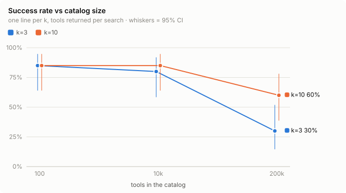
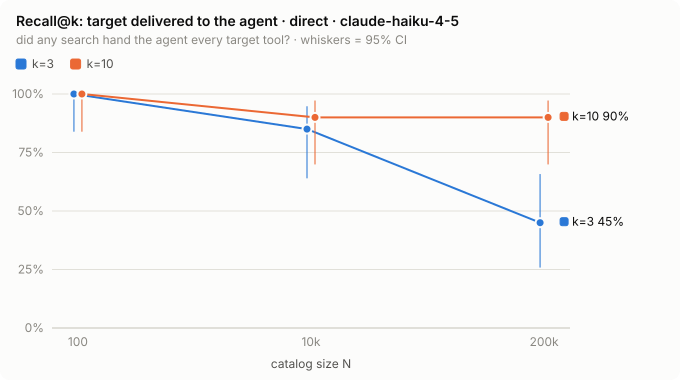
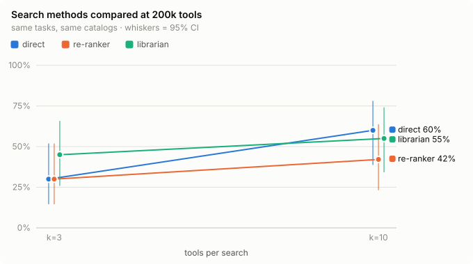

# Results: `main1`

claude-haiku-4-5 · 20 tasks · catalogs of 100 / 10k / 200k tools · 199 trials · 2026-09-26

- **Catalog size only matters at the top end.** Success holds at 80–85% up to 10k tools, then drops
  to 30% with 3 tools per search and 60% with 10 at 200k. With 3 per search, 11 tasks went from pass
  to fail between 100 and 200k tools and none went the other way (p = 0.001).
- **Two different failures.** With 3 per search the right tool often never reaches the agent (45%
  delivered at 200k). With 10 it arrives 90% of the time, but the agent then picks a near-identical
  tool from the same vendor about a third of the time: `daybay_v2` for "Daybay", or the by-id tool
  when the prompt gives a URL.
- **Better search didn't help.** A librarian model cost 2.5× the calls and time, and a local
  re-ranker moved the right tool into the top 3 for 76% of searches offline (up from 60%). Neither
  changed success, because what's left is choosing between twins, not finding the tool.
- **Two-step tasks weren't harder** than single ones.

One model, 20 tasks, one run per setting, synthetic tools: only the catalog-size drop is
statistically solid. At 100 tools, 5 of 40 trials failed because Claude Code hadn't picked up a tool
it had just been given, so those numbers are slightly low. One re-ranker trial hit a harness error
and was dropped.

## Catalog size



| tools | k=3 | k=10 |
|---|---|---|
| 100 | 85% | 85% |
| 10k | 80% | 85% |
| 200k | 30% | 60% |



| tools | k=3 | k=10 |
|---|---|---|
| 100 | 100% | 100% |
| 10k | 85% | 90% |
| 200k | 45% | 90% |

## Search methods at 200k tools

- **direct**: embed the request, hand over the top k.
- **re-ranker**: take the top 50, re-order them with a small local cross-encoder, hand over k.
- **librarian**: a second model runs filtered searches and picks up to k.



| setting | method | success | delivered | model calls | seconds |
|---|---|---|---|---|---|
| k=3 | direct | 30% | 45% | 6.5 | 16 |
| k=3 | re-ranker | 30% | 60% | 5.8 | 16 |
| k=3 | librarian | 45% | 55% | 16.6 | 42 |
| k=10 | direct | 60% | 90% | 6.2 | 16 |
| k=10 | re-ranker | 42% | 79% | 5.7 | 14 |
| k=10 | librarian | 55% | 80% | 14.4 | 37 |

## Reproduce

```sh
npm install && docker compose up -d qdrant
npm run gen -- --count 200000 --tasks 30 --multi 10 --seed 42 --task-seed 7 --quiet
npm run index
npm run experiment -- --N 100,10000,200000 --k 3,10 --mode direct \
  --tasks t001-t015,t031-t035 --repeats 1 --model claude-haiku-4-5 --seed 1 \
  --run-id main1-rerun
npm run experiment -- --N 200000 --k 3,10 --mode query_agent --tasks t001-t015,t031-t035 \
  --repeats 1 --model claude-haiku-4-5 --seed 1 --run-id main1-rerun
npm run experiment -- --N 200000 --k 3,10 --mode rerank --tasks t001-t015,t031-t035 \
  --repeats 1 --model claude-haiku-4-5 --reranker minilm --seed 1 --run-id main1-rerun
npm run results -- --run-id main1-rerun
```

The model is sampled, so a rerun lands near these numbers rather than on them. More tables are in
[details.md](details.md), every trial is in `trials.csv`, and `report.html` shows the searches and
calls of each one.
